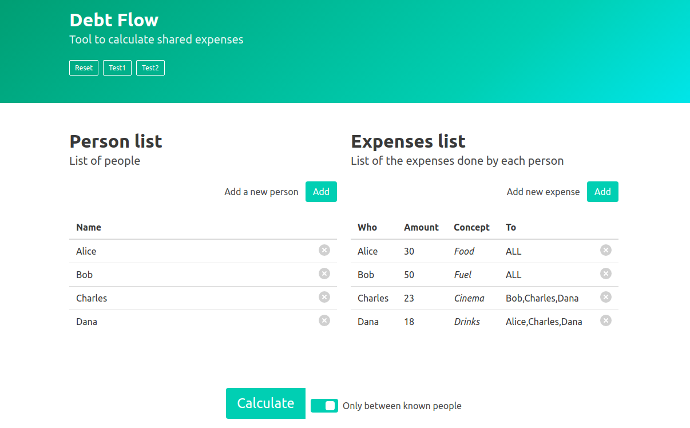
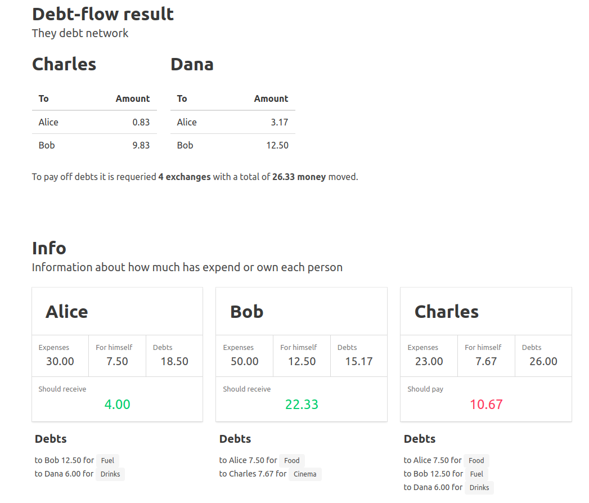

# Debt flow

Tool to calculate shared expenses
[Debt flow](https://javfres.github.io/debt-flow/).

I've started this project because I wanted to do something
similar to *Splitwise* or *Settle up*.

It uses a simple algorithm that first builds a graph
of debts and then it does several iterations to try to
simplify it traversing paths longer each time.

The algorithm can be limited to people that *known* each other,
meaning people that have debts between them
or all with all.

## Tecnology

This is a simple javascript page that uses [vue](https://vuejs.org/) and [lodash](https://lodash.com/).
I just realized that [jquery](https://jquery.com/) is there too for some animation.
The css framework is [bulma](https://bulma.io/).

I use [webpack](https://webpack.js.org/) to handle all the sources.

## Usage

* `npm run build` to generate the final version
* `npm run watch` for development

Both commands compile the sources into the *dist* folder.

## Main files

* *dist* folder to put the compiled files. 
* npm stuff: *node_modules*  *package.json*  *package-lock.json* 
* *Readme.md* This file
* *src* Source folder
    * *app.js* Javascript entrypoint
    * *app.scss* CSS entrypoint
    * *index.html* Main html file
* *webpack.config.js* The webpack config file

## More screenshots

